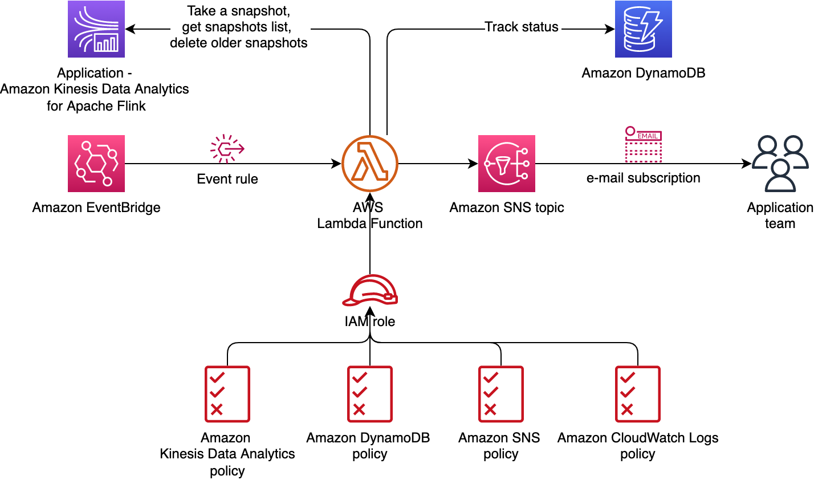
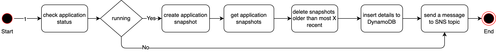

# Snapshot Manager - Amazon Managed Service for Apache Flink (formerly Amazon Kinesis Data Analytics)

--------
>  #### 🚨 August 30, 2023: Amazon Kinesis Data Analytics has been renamed to [Amazon Managed Service for Apache Flink](https://aws.amazon.com/managed-service-apache-flink).

--------

Snapshot Manager - [Amazon Kinesis Data Analytics](https://docs.aws.amazon.com/kinesisanalytics/latest/java/how-it-works.html) for Apache Flink offers the following benefits:

   1. takes a new snapshot of a running Kinesis Data Analytics for Apache Flink  Application
   1. gets a count of application snapshots
   1. checks if the count is more than the required number of snapshots
   1. deletes older snapshots that are older than the required number

This will be deployed as an [AWS Lambda](https://aws.amazon.com/lambda/) function and scheduled using [Amazon EventBridge rules](https://docs.aws.amazon.com/eventbridge/latest/userguide/eb-rules.html) e.g. once in a day or week.

**Contents:**

* [Architecture](#architecture)
* [Process flow diagram](#process-flow-diagram)
* [Prerequisites](#prerequisites)
* [AWS service requirements](#aws-service-requirements)
* [Deployment instructions using AWS console](#deployment-instructions-using-aws-console)

---

## Architecture

Figure below represents the architecture of Snapshot Manager.



---

## Process flow diagram

Figure below represents the process flow of Snapshot Manager.



---

## Prerequisites

  1. Python 3.7
  1. IDE e.g. [PyCharm](https://www.jetbrains.com/pycharm/)
  1. Access to AWS Account
  1. A running Kinesis Data Analytics for Apache Flink Application

---

## AWS service requirements

The following AWS services are required to deploy this starter kit:

 1. 1 AWS Lambda Function
 1. 1 Amazon SNS Topic
 1. 1 Amazon DynamoDB Table
 1. 1 IAM role with 4 policies
 1. 1 AWS CloudWatch Event Rule

---

## Deployment instructions using AWS console

1. Create an SNS Topic and subscribe required e-mail id(s)
1. Create a DynamoDB Table
   1. Table name= ```snapshot_manager_status```
   1. Primary partition key: name= ```app_name```, type= String
   1. Primary sort key: name= ```snapshot_manager_run_id```, type= Number
   1. Provisioned read capacity units = 5
   1. Provisioned write capacity units = 5
1. Create following IAM policies
   1. IAM policy with name ```iam_policy_dynamodb``` using [this sample](./resources/iam_policy_dynamodb.json)
   1. IAM policy with name ```iam_policy_sns``` using [this sample](./resources/iam_policy_sns.json)
   1. IAM policy with name ```iam_policy_kinesisanalytics``` using [this sample](./resources/iam_policy_kinesisanalytics.json)
   1. IAM policy with name ```iam_policy_cloudwatch_logs``` using [this sample](./resources/iam_policy_cloudwatch_logs.json)
1. Create an IAM role for Lambda with name ```snapshot_manager_iam_role``` and attach above policies
1. Deploy **snapshot_manager** function

    1. Function name = ```snapshot_manager```
    1. Runtime = Python 3.7
    1. IAM role = Select ```snapshot_manager_iam_role``` created above
    1. Function code = Copy the contents from [amazon_kinesis_data_analytics_for_apache_flink_snapshot_manager.py](./amazon_kinesis_data_analytics_for_apache_flink_snapshot_manager.py)
    1. Under General configuration:
        1. Timeout = e.g. 5 minutes
        1. Memory = e.g. 128 MB
    1. Environment variable = as defined in the following table

         | Key   | Value  | Description |
         |-------| -------| ----------- |
         | aws_region  | us-east-1 | AWS region |
         | app_name | ```Application Name``` | Application name of Kinesis Data Analytics for Apache Flink |
         | snapshot_manager_ddb_table_name  | ```snapshot_manager_status``` | Name of the DynamoDB table used to track the status |
         | primary_partition_key_name | ```app_name``` | Primary partition key name |
         | primary_sort_key_name | ```snapshot_manager_run_id``` | Primary sort key name |
         | sns_topic_arn | ```SNS Topic ARN``` | SNS Topic ARN  |
         | number_of_older_snapshots_to_retain | ```30``` | The number of most recent snapshots to be retained  |
         | snapshot_creation_wait_time_seconds | ```15``` | Time gap in seconds between consecutive checks to get the status of snapshot creation  |
1. Go to Amazon Create EventBridge and create a rule
   
   1. Name = ```SnapshotManagerEventRule```
   1. Description = EventBridge Rule to invoke Snapshot Manager Lambda
   1. Define pattern = ```Schedule``` with desired fixed rate e.g. 6 Hours 
   1. Select targets
      1. Target = Lambda function
      1. Function = Previously created lambda Function ```snapshot_manager```
 

---

## License Summary

This sample code is made available under the MIT-0 license. See the LICENSE file.
